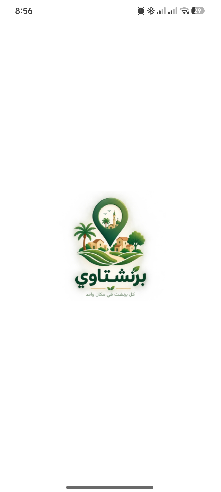
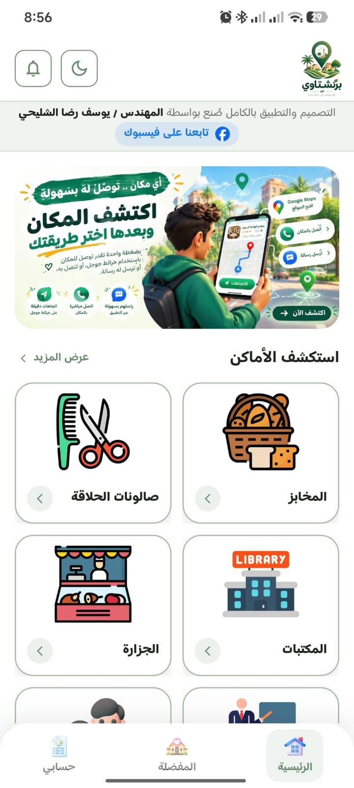
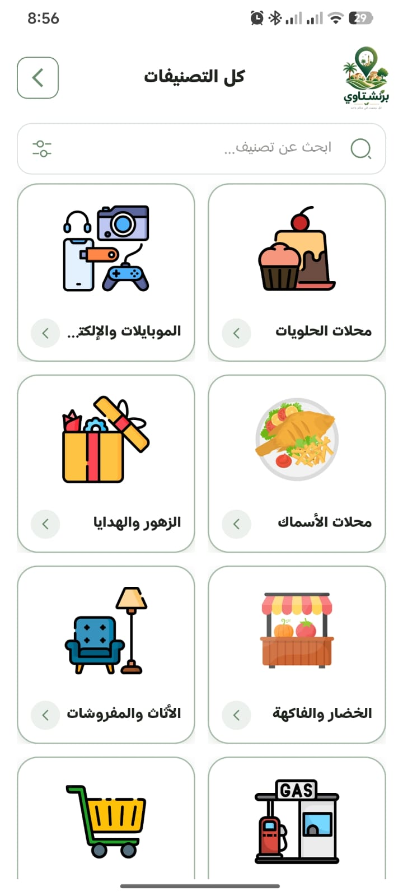
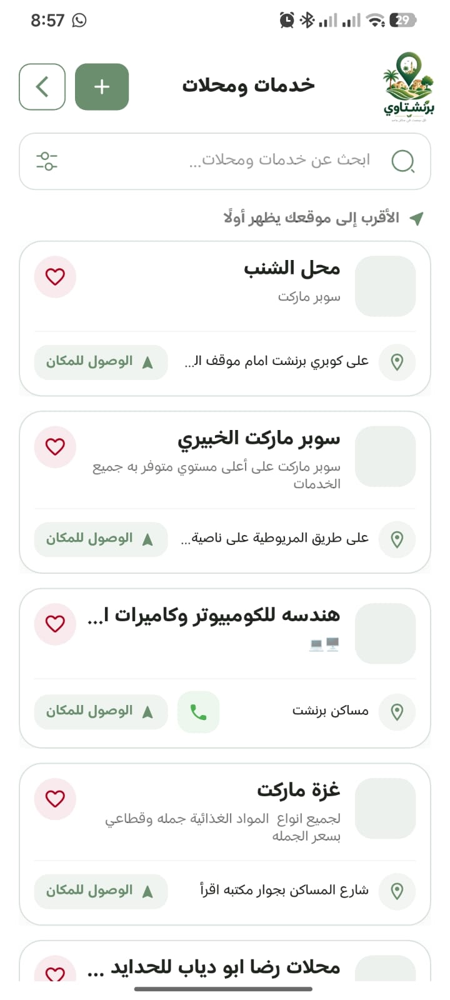
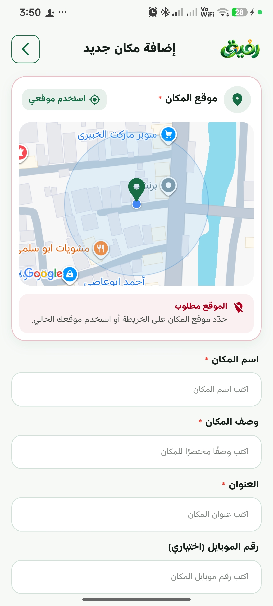
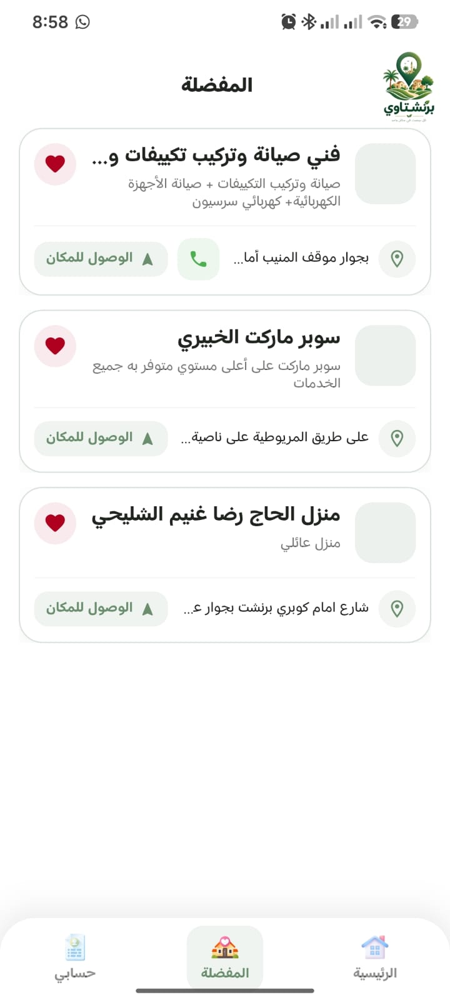
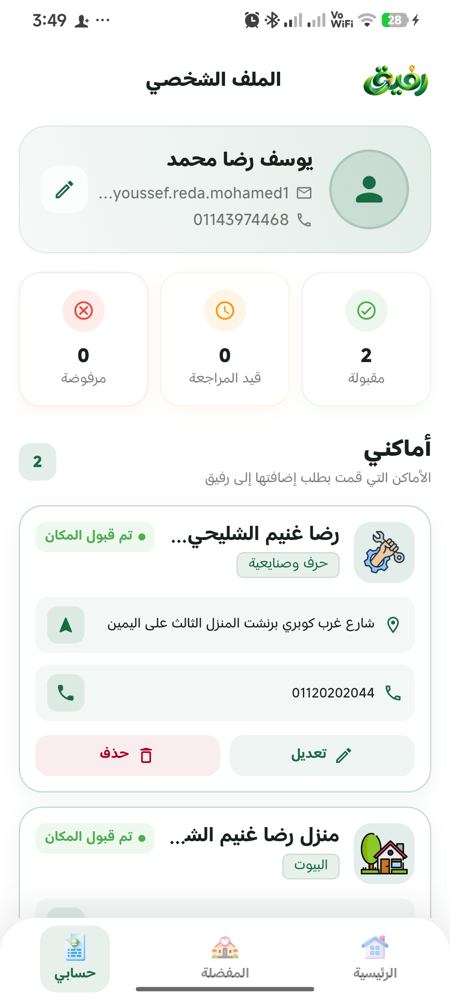

# Barnashtawy 📍

**Barnashtawy** is a Flutter-based local places discovery application that helps users discover, explore, and navigate to local places and services.

The application provides a simple way to browse places by category, search for locations, view place details, save favorites, and add new places.

## 📱 Screenshots

<p align="center">
  
  
  
  
</p>

<p align="center">
  
  
  
</p>

## ✨ Features

- Browse local places by category
- Search for places
- View detailed place information
- Add new places
- Save places to favorites
- View places on Google Maps
- Navigate to places
- Call places directly
- Location-based features
- Firebase Authentication
- Cloud Firestore
- Firebase Cloud Messaging
- Push notifications
- Arabic RTL interface
- Responsive Flutter UI

## 🛠 Tech Stack

- **Flutter**
- **Dart**
- **Firebase Authentication**
- **Cloud Firestore**
- **Firebase Cloud Messaging (FCM)**
- **Google Maps**
- **BLoC / Cubit**
- **REST APIs**
- **Clean Architecture**
- **Dependency Injection**
- **Git / GitHub**

## 🏗 Architecture

The project follows a feature-based architecture with separation of concerns between the presentation layer, business logic, repositories, and core services.

```text
lib/
├── core/
│   ├── services/
│   ├── utils/
│   ├── routing/
│   └── ...
│
└── features/
    ├── auth/
    ├── home/
    ├── categories/
    ├── places/
    ├── favorites/
    ├── profile/
    └── notifications/
```

## 🔥 Firebase

Firebase is used to support several core application features:

- Authentication
- Cloud Firestore
- Push Notifications
- User and application data management

## 📍 Location & Maps

The application uses location services and Google Maps to support location-based features and help users discover and navigate to places.

## 🔔 Notifications

Firebase Cloud Messaging (FCM) is used to provide push notifications and keep users informed about relevant application events.

## 🔐 Permissions

The application handles required device permissions such as:

- Location
- Notifications

Permissions are requested according to their role and necessity within the application.

## 📲 Google Play

Barnashtawy is available on Google Play.

**Google Play: https://play.google.com/store/apps/details?id=com.barnashtawy.app&pcampaignid=web_share

## 📂 Project Structure

```text
lib/
├── core/
├── features/
├── ...
│
screenshots/
├── splash.jpeg
├── home.jpeg
├── categories.jpeg
├── places.jpeg
├── add_place.jpeg
├── favorites.jpeg
└── profile.jpeg
```

## 🎯 Project Highlights

This project demonstrates practical experience in:

- Building production-oriented Flutter applications
- Firebase integration
- State management with BLoC/Cubit
- Location-based application development
- Google Maps integration
- Push notifications
- Clean and maintainable architecture
- Reusable Flutter components
- Arabic RTL application development

## 👨‍💻 Developer

**Youssef Reda Mohamed**

Flutter Developer & Software Engineer

[GitHub](https://github.com/YoussefReda-YRM)
